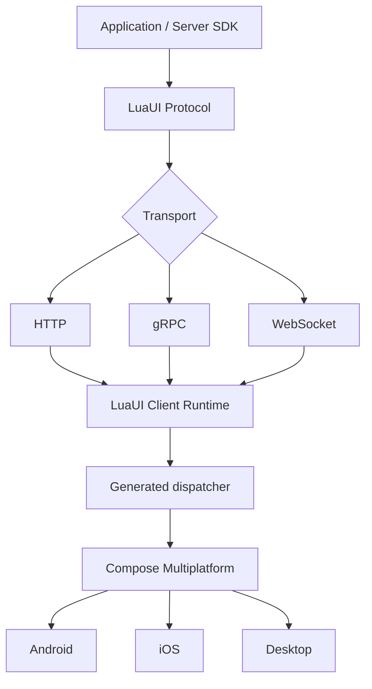

# LuaUI

> **A type-safe, full-stack Server-Driven UI framework for Kotlin Multiplatform and Compose Multiplatform.**
> *Weave dynamic interfaces across platforms.*

LuaUI giúp backend mô tả **cái gì** cần hiển thị, còn ứng dụng khách quyết định **hiển thị như thế nào** bằng UI native của từng nền tảng. Mục tiêu là thay đổi cấu trúc, nội dung và hành vi khai báo của màn hình mà không phải phát hành lại ứng dụng, nhưng chỉ trong giới hạn capability mà client đã cài đặt.

> **Trạng thái hiện tại — Architecture-first.** Repository này đang lưu Architecture Blueprint v1 và chưa có mã nguồn, artefact, hay hướng dẫn cài đặt để sử dụng trong production. Những module và khả năng nêu dưới đây là mục tiêu kiến trúc, không phải cam kết tính năng đã phát hành.

## Tại sao LuaUI?

LuaUI không phải là bộ chuyển đổi `JSON → Compose`. Đây là một nền tảng SDUI gồm protocol, Server SDK, client runtime, hệ thống state/action và hạ tầng render để xây dựng giao diện dynamic mà vẫn native, type-safe và đa nền tảng.



## Nguyên tắc cốt lõi

- **Server mô tả WHAT, client quyết định HOW.** Server gửi cấu trúc, dữ liệu, action và expression có khai báo; client giữ quyền render, design system và hành vi nền tảng.
- **Protocol là contract trung tâm.** Transport độc lập; Protobuf là hướng khuyến nghị, JSON là serialization thay thế, còn HTTP, gRPC và WebSocket là các lựa chọn transport.
- **Type-safe, generated và không reflection ở hot path.** KSP sinh registry, serializer, capability và dispatcher.
- **UI definition bất biến, state tách biệt.** Server state không lẫn với input, focus, scroll, gesture hay animation cục bộ.
- **Stable node ID là bắt buộc.** ID là nền tảng cho patch, reconciliation, state, analytics, Inspector và test; policy sinh/phạm vi identity được đặc tả trước public API.
- **Không tải hoặc thực thi mã từ server.** Action và expression chỉ có dạng declarative, allowlisted và được validate.
- **Thiết kế theo semantic.** Server gửi `Primary Button` hoặc token `title_medium`, không gửi pixel, màu hay lệnh render cụ thể.
- **Khả năng tương thích là first-class.** Capability negotiation và version độc lập cho protocol, schema, component, action, patch và expression.

## Phạm vi và ranh giới

LuaUI hướng tới Android, iOS và Desktop qua Kotlin Multiplatform + Compose Multiplatform. Web/Wasm là hướng tương lai.

LuaUI **không** là WebView, HTML renderer, JavaScript/Kotlin scripting runtime, remote-code-execution platform, backend tổng quát, database framework, networking framework thay thế hay Compose replacement.

## Golden path dự kiến

| Phần | Lựa chọn được ưu tiên trong tài liệu và sample dự kiến |
| --- | --- |
| Server | Kotlin, Ktor, LuaUI Server SDK |
| Contract | Protobuf |
| Kết nối | gRPC hoặc HTTP; WebSocket cho realtime |
| Client | Kotlin Multiplatform, LuaUI Runtime, KSP, Compose Multiplatform |
| Giao diện | Material 3 là mặc định, design-system adapter là first-class |
| Lưu trữ | Cache memory/Okio; SQLDelight là tùy chọn |
| Quan sát | Correlation IDs; OpenTelemetry/Kermit adapter là tùy chọn |

Đây là đường mặc định, không phải khóa chặt framework vào Ktor, gRPC, Material 3 hay một backend cụ thể.

## Lộ trình triển khai

Việc hiện thực bắt đầu bằng một vertical slice nhỏ thay vì dựng toàn bộ kiến trúc module ngay lập tức:

```text
Server DSL → LuaNode → Serialize → Transport → Decode
          → KSP dispatcher → Compose → LuaAction → Server
```

MVP dự kiến có tám module: `luaui-core`, `luaui-compose`, `luaui-material3`, `luaui-annotations`, `luaui-ksp`, `luaui-transport`, `luaui-server` và `sample`. NodeStore, patch, WebSocket, gRPC và offline persistence chỉ được mở rộng sau khi vertical slice này hoạt động.

Xem chi tiết tại [lộ trình](docs/roadmap.md).

## Tài liệu

| Nếu bạn muốn… | Đọc |
| --- | --- |
| Nắm kiến trúc và ranh giới hệ thống | [Tổng quan kiến trúc](docs/architecture/README.md) |
| Hiểu protocol, capability và evolution | [Protocol & compatibility](docs/architecture/protocol.md) |
| Hiểu runtime, render, state, action, patch và offline | [Runtime & rendering](docs/architecture/runtime.md) |
| Hiểu design system, server SDK và transport | [Nền tảng & tích hợp](docs/architecture/platform.md) |
| Hiểu bảo mật, độ tin cậy, observability, hiệu năng và test | [Chất lượng & vận hành](docs/architecture/quality.md) |
| Xem các quyết định kiến trúc bền vững | [Architecture Decision Records](docs/adr/README.md) |
| Xem thuật ngữ chuẩn | [Glossary](docs/reference/glossary.md) |
| Bắt đầu đóng góp | [CONTRIBUTING.md](CONTRIBUTING.md) |

Chỉ mục đầy đủ nằm tại [docs/README.md](docs/README.md).

## Đóng góp

LuaUI ưu tiên tính nhất quán của protocol và tính an toàn của runtime hơn việc bổ sung nhanh nhiều component. Mọi thay đổi làm ảnh hưởng contract, ranh giới server/client, khả năng tương thích hoặc mô hình state cần có ADR và cập nhật tài liệu liên quan. Xem [hướng dẫn đóng góp](CONTRIBUTING.md) trước khi mở thay đổi.

## Giấy phép

Giấy phép chưa được công bố. Không coi repository hiện tại là một dependency có thể sử dụng trong production.
