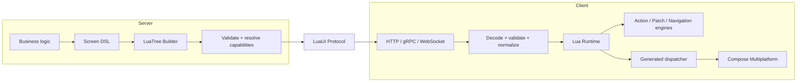

# Kiến trúc LuaUI

**Trạng thái:** Accepted architecture (Blueprint v1)

**Phạm vi:** Kotlin Multiplatform + Compose Multiplatform; Android, iOS và Desktop là các target chính. Web/Wasm là hướng tương lai.

## North star

> **Server mô tả WHAT; client quyết định HOW.**

LuaUI cung cấp một protocol và runtime để server cấu hình UI động trong giới hạn mà client hiểu và cho phép. Server có thể chạy business logic tuỳ ý, nhưng chỉ truyền **data, cấu trúc, action và expression có khai báo**. Client giữ quyền render native, design system, platform behavior và security boundary.



## Trách nhiệm theo lớp

| Lớp | LuaUI chịu trách nhiệm | Không chịu trách nhiệm |
| --- | --- | --- |
| Protocol | Schema, typed node, capability, metadata, action/patch/event contract | Authentication strategy hay business domain cụ thể |
| Server SDK | DSL, tree builder, validation, capability resolution, serialization | Thay thế backend hoặc database |
| Client runtime | Decode/validate, immutable tree, state boundary, action/patch/navigation dispatch | Tự vẽ layout hay thay Compose runtime |
| Renderer | Ánh xạ node semantic sang `@Composable` qua generated dispatcher | Ép một design system hoặc giao diện pixel-perfect từ server |
| Adapters | Transport, cache, persistence, analytics, tracing, design system | Buộc tất cả app dùng cùng adapter |

## Bất biến kiến trúc

1. **Type-safe contract:** node, action và expression có kiểu; không dùng payload tự do để né schema.
2. **Stable IDs:** mỗi node có ID ổn định; identity policy phải cho phép runtime resolve node một cách không mơ hồ trong screen hiện tại. ID là key cho NodeStore, patch, state, analytics, lazy list và test. Foundation 0.1 chốt uniqueness trong một screen; scope/generator/migration rộng hơn vẫn cần spec.
3. **Immutable definition:** screen/tree là definition bất biến; server state và local UI state có lifecycle riêng.
4. **Generated runtime path:** KSP sinh registration/dispatcher/serializer/capability registry; không reflection, classpath scan hay dynamic invoke trong hot path.
5. **Defensive client:** payload luôn decode và validate trước runtime; lỗi trở thành fallback quan sát được, không được làm app crash trực tiếp.
6. **Semantic rendering:** server gửi ý nghĩa như `PRIMARY`, `title_medium` hay `OrderSummary`; client quyết định cách hiện thực qua design system.
7. **Independent evolution:** protocol, schema, component, action, patch và expression version riêng; capability negotiation quyết định phần giao nhau.

## Mô hình component

```text
LuaComponent
├── Primitive  — Text, Icon, Image, Divider, Spacer
├── Layout     — Row, Column, Box, Lazy list, Grid
├── Control    — Button, TextField, Checkbox, Select, DatePicker
└── Business   — semantic component do thư viện hoặc ứng dụng định nghĩa
```

Business component là first-class. Khi client đã biết `OrderSummary`, server nên gửi `OrderSummaryNode` thay vì tái tạo một cây primitive dài. Điều này giảm payload, giảm chi phí render và bảo vệ nhất quán của design system.

## Cấu trúc module: đích đến và MVP

Kiến trúc đích có các vùng `core`, `compiler`, `rendering`, `state`, `actions`, `transport`, `storage`, `server`, `observability`, `tooling` và `samples`. Chúng là ranh giới logic, **không** phải chỉ thị phải tạo tất cả ngay từ đầu.

Foundation vertical slice ban đầu gồm:

```text
luaui-core · luaui-compose · luaui-material3 · luaui-annotations
luaui-ksp · luaui-transport · luaui-server · sample
```

Sau khi vertical slice chứng minh core contract, Runtime 0.2 thêm `luaui-runtime` cho NodeStore/ScreenStore; LocalStateStore hiện mới có policy kiến trúc. Không có dependency bắt buộc kiểu `luaui-all`. Adapter cho gRPC, SQLDelight, OpenTelemetry, analytics hay design system tùy chỉnh được thêm sau khi có consumer và contract tương ứng.

## Đọc tiếp

- [Protocol & compatibility](protocol.md)
- [Runtime & rendering](runtime.md)
- [LocalStateStore 0.2](../specs/runtime-local-state-store-0.2.md)
- [Platform & integration](platform.md)
- [Quality & operations](quality.md)
- [Các câu hỏi cần đặc tả](open-questions.md)
- [Architecture Decision Records](../adr/README.md)
