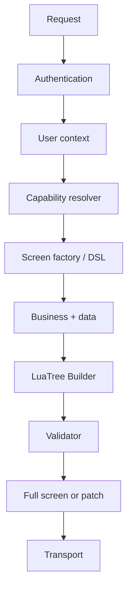

# Nền tảng & tích hợp

> **Status:** Accepted architecture (Blueprint v1)
>
> **Scope:** Các ranh giới extension của LuaUI. Adapter được nêu ở đây là kiến trúc đích, không phải dependency hiện có.

## Server SDK

Server được phép chạy business logic bình thường—auth, user context, feature flags, data access và domain rules—nhưng chỉ emit LuaUI definition có khai báo. Server không gửi executable Kotlin/JavaScript xuống client.



Mục tiêu developer experience là để server author màn hình qua DSL semantic, thay vì tự dựng protobuf:

```kotlin
luaScreen("/home") {
    column {
        text("Dashboard", typography = TitleLarge)
        priceCard(price = 1_500_000)
        button(text = "Continue", action = navigate("/checkout"))
    }
}
```

DSL phải đi qua tree builder, validation, capability resolution và serializer. Ví dụ này minh hoạ API mong muốn, không phải API đã tồn tại.

## Transport abstraction

Một transport đích có ba luồng interaction:

```kotlin
interface LuaTransport {
    suspend fun screen(request: ScreenRequest): ScreenResponse
    suspend fun action(request: ActionRequest): ActionResponse
    fun observe(screenId: String): Flow<LuaEvent>
}
```

Các adapter được định hướng:

| Adapter | Vai trò kiến trúc |
| --- | --- |
| HTTP / Ktor | Request-response, thuận tiện cho start nhỏ |
| gRPC / Protobuf | Golden path cho full-stack LuaUI |
| WebSocket | Realtime event/patch sau MVP |
| Local/Fake | Test, preview và development tooling |

Transport không được rò rỉ vào core component model. Một `LuaScreen`, `LuaAction` hay `LuaPatch` phải giữ cùng semantics dù đi qua HTTP, gRPC hay WebSocket. Ktor, gRPC, WebSocket và Spring adapter không phải dependency bắt buộc của core.

## Design system boundary

Server giao tiếp bằng **semantics**, không phải pixel instructions:

| Server nên gửi | Server không nên gửi |
| --- | --- |
| `variant = PRIMARY`, `size = LARGE` | `background = #00FF13`, `radius = 13.7` |
| `typography = title_medium` | tên font / kích thước pixel cụ thể |
| `spacing = medium`, `shape = large` | padding, corner, color hard-code |
| `OrderSummaryNode` | cây primitive thay thế component semantic có sẵn |

Client resolve semantic node/token qua design system cài đặt:

```text
ButtonNode → TokenResolver → DesignSystem → @Composable native
```

Token định hướng gồm `ColorToken`, `TypographyToken`, `SpacingToken`, `ShapeToken`, `ElevationToken`, `IconToken` và `MotionToken`.

Material 3 là default chính thức theo blueprint, nhưng **không bắt buộc**. Một ứng dụng có thể thêm adapter Material 3, Cupertino hoặc company design system mà không fork LuaUI. Contract token/fallback, dark mode, dynamic type, RTL và accessibility semantics vẫn cần phát triển thành spec.

## Custom components và generated integration

Custom/business component là first-class. Developer định nghĩa typed node và renderer, còn KSP sinh registration cần thiết:

```kotlin
@LuaComponent("price_card")
data class PriceCardNode(
    override val id: String,
    val price: Long,
) : LuaNode

@LuaRenderer(PriceCardNode::class)
@Composable
fun PriceCardRenderer(node: PriceCardNode) {
    PriceCard(node.price)
}
```

Generated code dự kiến gồm component/renderer/serializer/action/capability registry và dispatcher. Không cần manual registration. Versioning, fallback và serialization của custom component liên module phải tuân thủ [protocol & compatibility](protocol.md).

## Extension points có chủ đích

| Concern | Core abstraction | Adapter/examples định hướng |
| --- | --- | --- |
| Navigation | `LuaNavigator` | Compose Navigation, custom navigator |
| Cache | `LuaCache` | memory, Okio/disk, SQLDelight adapter |
| Analytics | `LuaAnalytics` | Firebase, Amplitude, Mixpanel, custom |
| Logging/tracing | abstraction | Kermit, OpenTelemetry |
| Design system | renderer/token adapter | Material 3, Cupertino, company DS |
| Transport | `LuaTransport` | HTTP, gRPC, WebSocket, Fake |

Core không nên có dependency trực tiếp vào Firebase, SQLDelight, một navigation library hay company design system. Khi thêm extension point, ưu tiên một semantic interface nhỏ hơn là kéo adapter vào runtime core.

## Golden path

LuaUI vẫn cần một stack ưu tiên để sample và docs không trở thành “dùng gì cũng được”:

```text
Server: Kotlin + Ktor + LuaUI Server + Protobuf + gRPC/HTTP + WebSocket + OpenTelemetry
Client: Kotlin Multiplatform + LuaUI Runtime + KSP + Protobuf + Compose + Material 3
        + Ktor/gRPC + Okio (+ SQLDelight optional)
```

Golden path là mặc định tài liệu; nó không biến các adapter khác thành second-class hay bắt buộc mọi ứng dụng dùng chúng.
