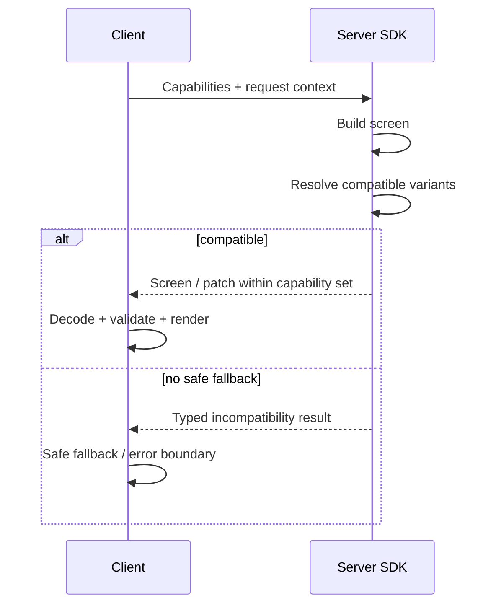

# Protocol & compatibility

> **Status:** Accepted architecture (Blueprint v1)
>
> **Scope:** Contract đích giữa Server SDK và Client Runtime; đây chưa phải là file `.proto` hay API wire đã phát hành.
>
> **Quy ước:** “BẮT BUỘC” chỉ ra invariant của contract; chi tiết chưa chốt được ghi là Open.

LuaUI Protocol là contract quan trọng nhất của hệ thống. Transport, framework server và design system có thể thay đổi; protocol phải giữ được ý nghĩa UI, tính an toàn và đường evolution giữa chúng.

## Mô hình dữ liệu

Một screen về mặt khái niệm gồm:

```text
LuaScreen
├── id
├── schemaVersion
├── root: LuaNode
├── requiredCapabilities
└── metadata
```

`LuaNode` luôn có `id` và exactly one typed content, ví dụ `TextNode`, `ButtonNode`, `ColumnNode`, `LazyListNode` hoặc `CustomNode`. Baseline component set, field shape và wire field number chưa được công bố; ví dụ trên chỉ mô tả ranh giới contract.

### Stable node ID

Mỗi node **BẮT BUỘC** có stable ID. ID phải tiếp tục ổn định khi node còn cùng ý nghĩa nghiệp vụ; không được dùng vị trí trong tree làm ID. Identity policy phải cho phép runtime resolve node không mơ hồ trong screen hiện tại. Foundation 0.1 chốt ID unique trong một screen; policy cho các version sau vẫn có thể mở rộng có chủ đích.

```text
home
home.header
product.123
weight.938
summary.total
```

Stable ID là key chung cho NodeStore, patch, state reconciliation, lazy key, animation, analytics, Inspector và fixture test. Quy tắc sinh/đổi tên ID, scope ngoài một screen, phạm vi session và migration vẫn là [Open](open-questions.md#stable-id--patch). Xem quy tắc 0.1 tại [Protocol 0.1](../specs/protocol-0.1.md).

## Schema và serialization

Protobuf là canonical/recommended path của kiến trúc. `kotlinx.serialization`/JSON là đường thay thế để phục vụ transport hoặc môi trường không dùng Protobuf. Cả hai phải ánh xạ vào **cùng một semantic contract**; serialization không được tạo hai loại component hoặc hai model compatibility khác nhau.

| Quyết định | Hệ quả |
| --- | --- |
| Contract có kiểu | Node/action/expression không được bọc trong payload JSON tự do để né validation. |
| Definition bất biến | Payload mô tả tree/state server; client không mutates definition tại chỗ để phản ánh local UI state. |
| Schema evolution có chủ đích | Thay đổi public field phải có compatibility story và fixture test trước khi phát hành. |
| Decode trước, runtime sau | Payload chưa validate không được đi vào renderer hay action handler. |

Chính sách field presence, unknown-field behavior, JSON mapping và source of truth của schema cần được chốt trước khi tạo public wire format. Xem [câu hỏi mở](open-questions.md#schema--wire-format).

## Versioning đa lớp

LuaUI không dùng một `version = 1` cho toàn hệ thống. Các lớp tiến hóa độc lập:

| Lớp | Mục đích |
| --- | --- |
| SDK version | Tương thích của API client/server SDK |
| Protocol version | Envelope và quy tắc trao đổi nền tảng |
| Schema version | Shape/semantic của screen và node |
| Component version | Khả năng của từng component, ví dụ `Button@3` |
| Action version | Hành vi/fields của từng action |
| Patch version | Format và semantics của patch |
| Expression version | Tập operation và semantics expression |

Không có số version hiện hành trong repository. Các ví dụ như `Chart@2` hay `schema = 5` là minh hoạ kiến trúc, không phải phiên bản phát hành.

## Capability negotiation

Client công bố khả năng đã cài đặt: protocol/schema, component/action và phiên bản, patch/expression version cùng giới hạn liên quan. Server resolve screen dựa trên phần giao nhau này.



Server không được gửi component, action, expression hoặc patch mà client không công bố là hiểu được. Khi server có `Chart@2` còn client chỉ có `Chart@1`, server phải chọn fallback tương thích hoặc trả về lỗi có kiểu—không để unknown payload làm runtime crash.

## Contract khai báo, không phải code từ xa

Protocol có thể mang data, tree, metadata, declarative action và expression AST. Nó **không** mang Kotlin code, JavaScript, script, class/method name để invoke tùy ý hay bất kỳ executable payload nào.

### Actions

Nhóm action built-in được định hướng gồm `Navigate`, `Back`, `UpdateState`, `Submit`, `Refresh`, `OpenUrl`, `ShowDialog`, `ShowMessage`, `Track`, `Composite` và `Custom`. `Custom` vẫn là một action typed được handler client đăng ký trước qua KSP; không phải lệnh gọi method tải từ server.

### Expressions

Expression là AST allowlisted cho logic động như so sánh, boolean, số học, `Contains`, `IsEmpty`, `State` và `Constant`. Runtime không dùng `eval()`, JavaScript, Kotlin scripting hoặc arbitrary function invocation. Semantics của null, numeric overflow, lỗi phép chia và giới hạn độ phức tạp phải được đặc tả trước khi public API ổn định.

## Patch và event

Initial load mang full `LuaScreen`; thay đổi tăng dần dùng patch với các operation định hướng: `Update`, `Replace`, `Insert`, `Remove`, `Move` và `Batch`. Patch luôn tham chiếu stable ID, phải được validate trước khi áp vào NodeStore và phải đi qua version/capability check như full screen.

Revision, ordering, atomicity của batch, idempotency và conflict với local state chưa được chốt. Chúng không được suy đoán trong implementation; theo dõi tại [stable ID & patch](open-questions.md#stable-id--patch).

## Transport độc lập

Contract này được thiết kế để đi qua:

- HTTP + JSON;
- HTTP + Protobuf;
- gRPC + Protobuf (golden path được khuyến nghị);
- WebSocket + Protobuf cho realtime;
- local/fake transport cho test và preview.

Transport chịu trách nhiệm cho delivery, auth handshake/retry theo ứng dụng và connection lifecycle. LuaUI định nghĩa ý nghĩa screen/action/patch/event, không thay thế networking stack hay auth system của app.

## Validation và lỗi tương thích

Client phải thực hiện chuỗi `decode → validate → normalize → runtime`. Validation bao gồm shape/schema, capability, limit kích thước/độ sâu/số node/độ dài string và patch reference. Payload không hợp lệ đi vào error boundary với diagnostic an toàn; nó không được làm ứng dụng crash trực tiếp.

Xem [Runtime & rendering](runtime.md#error-boundaries) để biết lifecycle lỗi và [Quality & operations](quality.md#security-model) cho các guardrail bảo mật.
