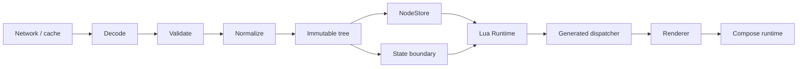
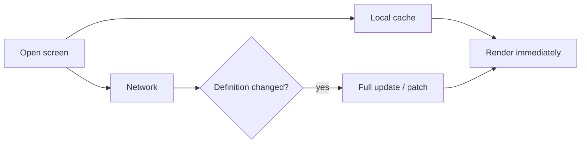

# Runtime & rendering

> **Status:** Accepted architecture (Blueprint v1)
>
> **Scope:** Hành vi đích của Client Runtime; không phải inventory tính năng đã hiện thực.

LuaUI Runtime chuyển một LuaUI definition đã validate thành UI Compose native, đồng thời quản lý state boundary, actions, patches, navigation và cache. LuaUI không thay Compose runtime.

## Lifecycle của một screen



Mọi payload phải đi qua `Decode → Validate → Normalize` trước khi tạo immutable tree. Renderer không nên nhận raw network payload hay tự quyết định payload có hợp lệ hay không.

## Ranh giới LuaUI và Compose

| LuaUI Runtime | Compose Runtime |
| --- | --- |
| Schema, immutable tree, capability, state boundary | Composition và recomposition |
| Action, patch, navigation dispatch | Layout, draw, input |
| Validation, error boundary, cache coordination | Animation và platform UI behavior |
| Node lookup/reconciliation | Native rendering lifecycle |

Đường render đích là:

```text
LuaNode → generated dispatcher → typed renderer → @Composable → Compose
```

KSP sinh component registry, renderer registry, serializer registry, action registry và capability registry. Dispatcher sử dụng typed `when` hoặc mã tương đương; không `Class.forName()`, annotation scan, reflection hay dynamic invoke trong hot path.

## Definition, server state và local state

Một UI definition là bất biến. State được phân tách rõ:

| Loại | Ví dụ | Chủ sở hữu/lifecycle |
| --- | --- | --- |
| Server state | products, price, permission, title, configuration | Server mô tả hoặc cập nhật qua full screen/patch |
| Local UI state | text input, focus, scroll, gesture, animation, expanded state | Client/Compose; không round-trip mỗi thay đổi |

Ví dụ: người dùng gõ `1 → 12 → 123 → 1234` vào `TextField` thì text được giữ trong local snapshot state. Client chỉ dispatch `LuaAction` ở thời điểm đúng như debounce, blur hoặc submit. Điều này tránh biến mỗi keystroke thành network request.

Quy tắc ownership khi patch va chạm local edit, draft persistence và conflict resolution là [Open](open-questions.md#offline--local-edits).

## NodeStore và reconciliation

Tree giữ quan hệ cấu trúc; `NodeStore` giữ index `NodeId → LuaNode`. Nhờ stable ID, runtime không cần traverse toàn bộ tree để tìm node cần update.

```text
Patch → Patch validator → NodeStore lookup → Tree reconciliation
      → invalidate relevant state → Compose recomposition
```

Mục tiêu kiến trúc là lookup O(1) theo ID và invalidation granular: khi hai node thay đổi trong một tree lớn, chỉ vùng liên quan cần bị invalidated. Đây là intent thiết kế, không phải benchmark đã công bố.

Patch operation dự kiến gồm `Update`, `Replace`, `Insert`, `Remove`, `Move` và `Batch`. Full screen và patch có cùng yêu cầu validation/capability. Chi tiết revision, ordering và atomicity nằm trong [câu hỏi mở](open-questions.md#stable-id--patch).

## Action engine

Tương tác của người dùng đi theo pipeline:

```text
User interaction → LuaAction → ActionDispatcher
                 → State | Navigation | Network | Custom handler
```

Action là declarative. Built-in action giúp runtime thực hiện các thao tác phổ biến; custom action được ánh xạ đến handler đã được ứng dụng đăng ký và KSP generate registration. Server không thể yêu cầu client invoke method bất kỳ.

`Composite` phải được giới hạn/validate để tránh action graph không kiểm soát. Quy tắc retry, cancellation, progress và idempotency của network action là phần cần đặc tả trước khi public API ổn định.

## Expression engine

Expression cho phép server mô tả logic UI động mà không gửi code. Ví dụ `visible = total > 0 AND canCheckout == true` được encode như AST typed, chỉ gồm operation được allowlist.

| Nhóm | Operation định hướng |
| --- | --- |
| So sánh | `Equal`, `NotEqual`, `GreaterThan`, `LessThan` |
| Boolean | `AND`, `OR`, `NOT` |
| Số học | `Add`, `Subtract`, `Multiply`, `Divide` |
| Tiện ích | `Contains`, `IsEmpty`, `State`, `Constant` |

Runtime không eval script. Expression phải được validate về type, version, độ sâu và số operation trước evaluate.

## Navigation

`LuaNavigator` là abstraction. Action `Navigate(route)` được app map sang Compose Navigation hoặc custom navigator; core không khóa vào navigation library nào. Grammar của route, deep-link trust boundary và OpenUrl allowlist cần được đặc tả ở cấp ứng dụng/protocol trước khi production use.

## Offline và realtime

Kiến trúc offline là cache-first:



Các lớp cache đích là memory → disk/Okio → SQLDelight adapter tùy chọn. SQLDelight không thuộc core. WebSocket là hướng realtime sau MVP; cache key, TTL, session isolation, encryption và offline action queue vẫn cần spec.

## Error boundaries

Payload lỗi không được crash app trực tiếp. Runtime phải cô lập lỗi bằng các fallback như:

- `LuaErrorBoundary`;
- `UnknownNodeRenderer`;
- `UnsupportedComponentRenderer`;
- `TransportErrorRenderer`;
- `SchemaErrorRenderer`.

Ở debug, diagnostics phải cho thấy nguyên nhân có thể hành động, ví dụ component/version client không hỗ trợ. Ở production, fallback an toàn không được lộ payload nhạy cảm. Chi tiết logging/redaction thuộc [Quality & operations](quality.md).
